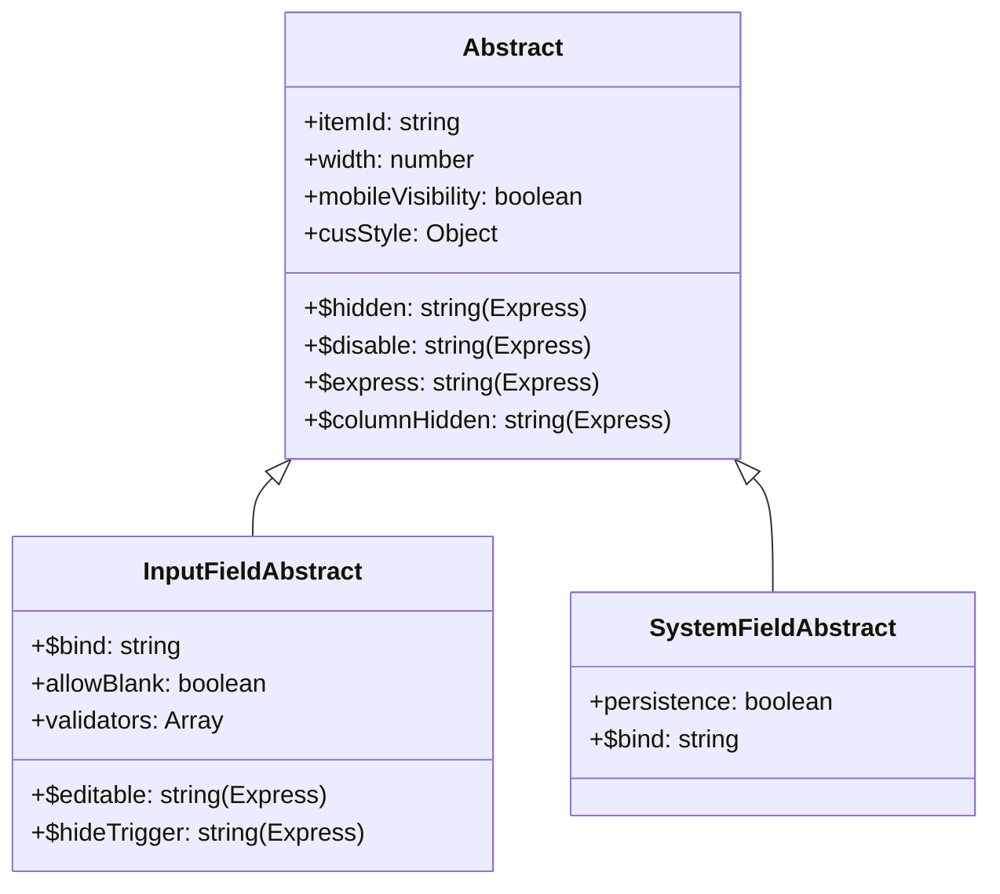

# Guru-X BPM 表單自動生成技術規格書 (Form Generation Specification)

本規格書是基於對 `/form_material` 目錄中 **9 張真實表單範本**進行深度逆向分析，並對比 **`ZHYSoft/form/field` 核心元件底層原始碼**彙整重構而成之最高標準規範。

旨在為「自動化表單生成器」提供清晰、精確且可落地實作的**中繼模型（Metadata Schema）**、**組件目錄（Component Catalog）**、**佈局系統（Layout Rules）**以及**動態綁定機制（Data Binding & Mapping）**說明。

---

## 1. 表單引擎核心架構與檔案格式

本質為 **ExtJS 類別定義檔 (JavaScript)**。結構分為四大板塊：

```javascript
Ext.define('ZHYSoft.form.NewForm', {
    extend: 'ZHYSoft.form.AbstractForm',
    bodyPadding: 20,
    funcs: { 
        // 1. 自訂客戶端計算函數 (例如：獲取語系)
    },
    validators: { 
        // 2. 自訂欄位驗證函數
    },
    definition: {
        // 3. 核心宣告式定義 (JSON 格式)
        "components": { ... }, // 所有視覺/排版組件
        "$items": [ ... ]      // 頂層組件渲染順序
    },
    initComponent: function(){
        // 4. 初始化勾子與動態多國語系翻譯邏輯
    }
});
```

> [!IMPORTANT]
> **自動生成策略**：在自動生成器中，我們應將表單定義抽離為純 JSON 的中繼格式（Metadata），在部署至 Guru-X 平台時，再由生成器套入此 ExtJS 模板中，動態生成合規的 JS 檔並透過 API 發佈。

---

## 2. 元件底層繼承體系與通用屬性 (Inheritance & Common Properties)

Guru-X 表單欄位元件採用高度物件導向的設計，所有拖拉拽欄位皆繼承自底層的三個抽象基礎類別（Base Abstracts）。這三個基礎類別定義了欄位在設計器中展示的配置屬性。



### 2.1 基礎欄位抽象類別通用屬性 (`Abstract`)
適用於所有視覺、佈局或輸入型欄位：
*   **`itemId`**：元件在表單範本中的唯一標識符（由 `$$$fieldItemId()` 配置）。
*   **`$hidden`**：隱藏條件表達式（Form Express），動態控制元件是否隱藏。
*   **`$disable`**：唯讀/停用條件表達式，動態控制元件是否可操作。
*   **`$express`**：公式表達式，用於動態計算欄位數值或連動邏輯。
*   **`width`** / **`minWidth`**：元件寬度屬性，支援自適應與固定寬度。
*   **`$columnHidden`**：當該元件置於細表中時的列隱藏表達式。
*   **`mobileVisibility`**：移動端可見性開關。
*   **`cusStyle`**：自訂佈景主題，包含：
    *   `themeCls`：自訂主題 CSS Class。
    *   `themeColor`：主題主色（十六進位色彩）。
    *   `titleColor`：標題文字顏色。

### 2.2 輸入繫結抽象類別專屬屬性 (`InputFieldAbstract`)
適用於所有需要與資料庫欄位進行資料繫結（Data Binding）及內容填寫的元件（繼承自 `Abstract`）：
*   **`$bind`**：綁定的資料庫欄位名稱（對應資料模型欄位）。
*   **`allowBlank`**：是否允許為空（即 `Required` 必填項，選中時 `allowBlank = false`）。
*   **`validators`**：自訂欄位格式驗證器（如電子郵件、電話、自訂正則等）。
*   **`$editable`**：可編輯條件表達式，支援在特定流程步驟或條件下啟用/禁用編輯。
*   **`$hideTrigger`**：隱藏下拉或開窗按鈕（Trigger）的條件表達式。

### 2.3 系統自動欄位抽象類別專屬屬性 (`SystemFieldAbstract`)
適用於平台預設自動回填的系統層級唯讀欄位（繼承自 `Abstract`）：
*   **`persistence`**：是否需要持久化保存（若開啟，系統回填的值將會寫入資料庫對應欄位；若關閉，則僅在運行時前端動態載入而不保存）。
*   **`$bind`**：持久化啟用時繫結的資料庫欄位。

---

## 3. 佈局與排版系統 (Layout & Containers)

Guru-X 表單採用**宣告式樹狀佈局**。渲染時，引擎會從 `definition.$items` 的根節點出發，依序向下遞迴渲染。

### 3.1 頂層堆疊 (`definition.$items`)
定義了表單在畫面上**由上至下**的垂直堆疊順序。一般典型結構為：
1. `formtitle` (表單標題)
2. `segmentbar` (申請資訊區段)
3. `table` (基本申請資訊網格，2~3 欄)
4. `segmentbar` (核心業務資訊區段)
5. `table` 或 `grid` (核心業務網格或明細子表)

### 3.2 表格佈局 (`table` & `tablecell`)
* **`table` (表格容器)**：
  * `ctype`: `"table"`
  * `columns`: 欄數（常用 `2` 或 `3`）。
  * `cellVerticalAlign`: 垂直對齊方式，常用 `"middle"`。
  * `"$items"`: 包含的單格（`tablecell`）識別碼陣列。
* **`tablecell` (單格容器，無 `ctype` 屬性)**：
  * 靠 JSON 鍵值（如 `"tablecell1"`）與不含 `ctype` 來隱式判定。
  * `"$items"`: 放入此單格內的具體欄位組件識別碼陣列（例如 `["sn1"]`）。
  * `colspan`: 跨欄數（例如 `colspan: 2` 用於讓輸入框或附件欄橫跨整行）。
  * `rowspan`: 跨行數（例如在 `Meeting_Manage.json` 中，照片上傳組件使用 `rowspan: 3` 實現右側跨行排版）。

### 3.3 橫向伸縮佈局 (`hbox` & `flex`)
用於在單一行內橫向並排多個組件：
* **`hbox`**：具有 `layout: {"align": "stretch"}` 屬性。
* **`hboxcell`**：屬於 `tablecell` 的變體，帶有 `flex: 1` 屬性，表示自動等寬分配空間。

---

## 4. 完整組件目錄規格表 (Component Specs Directory)

以下為底層實作中所有可用表單元件的詳細功能、特有屬性及序列化欄位說明：

### 4.1 基礎輸入元件 (Basic Inputs)

#### 1. 單行文本框 (`text`)
*   **用途**：常規單行文字輸入。
*   **主要屬性**：
    *   `vtype`：格式驗證類別，選值：`text` (普通文字)、`mobile` (手機)、`phone` (電話)、`globalphone` (國際電話)、`tel` (座機)、`email` (電子郵件)、`postcode` (郵遞區號)、`url` (網址)、`identificationCard` (身份證)。
    *   `maxLength`：最大字元長度限制（預設 50，最長 2000）。
    *   `showScanBtn`：是否在移動端或支援設備上顯示掃條碼/二維碼按鈕。
    *   `emptyText`：輸入提示預設文字（Placeholder）。
    *   `fieldDesc`：欄位輔助說明。

#### 2. 多行文本框 (`textarea`)
*   **用途**：備註、原因等長文本輸入。
*   **主要屬性**：
    *   `growMin`：文字框自動增長最小高度（對應最小列數 `minRows`）。
    *   `growMax`：文字框自動增長最大高度（對應最大列數 `maxRows`）。
    *   `maxLength`：字元數上限。

#### 3. AI 智能編輯器 (`aieditor`)
*   **用途**：多行 AI 輔助智能輸入，整合大模型能力。
*   **主要屬性**：
    *   `growMin` / `growMax`：最小與最大行高。
    *   `maxLength`：預設上限 4000。
    *   內部集成 AI 連動提示詞與自動摘要、續寫擴展等大模型能力。

#### 4. HTML 富文本編輯器 (`htmleditorarea`)
*   **用途**：富文本編輯器，支援資料繫結。
*   **主要屬性**：
    *   提供完整的 HTML 格式化工具列。
    *   `growMin` / `growMax` 控制預設編輯區域的高。

#### 5. 數值輸入框 (`number`)
*   **用途**：金額、數量、里程等純數字輸入。
*   **主要屬性**：
    *   `thousands`：布林值，是否啟用千分位格式化（例如 `1,000,000`）。
    *   `digit`：小數保留位數（1 至 10 位，`-1` 或 `0` 表示整數）。
    *   `currency`：貨幣前綴符號，可選：`¥` (人民幣)、`＄` (美金)、`€` (歐元)、`NT` (新台幣) 等 16 種主流貨幣。
    *   `suffix`：數值單位後綴，可選：`%` (百分比)、`pcs` (個/件)、`kg`、`m²` 等 14 種常用計量單位。

#### 6. 日期時間選擇器 (`datetime`)
*   **用途**：日期、時間選擇。
*   **主要屬性**：
    *   `type`：格式規格，可選：
        *   `Ymd`：年月日 (YYYY-MM-DD)
        *   `Ym`：年月 (YYYY-MM)
        *   `YmdHi`：年月日時分 (YYYY-MM-DD HH:mm)
        *   `YmdHis`：年月日時分秒 (YYYY-MM-DD HH:mm:ss)
        *   `Hi`：時分 (HH:mm)
        *   `His`：時分秒 (HH:mm:ss)

#### 7. 開關控制鍵 (`switch`)
*   **用途**：二進位狀態切換（True/False，啟用/禁用）。常用於對應資料庫中的布林型欄位。

---

### 4.2 選擇與多選元件 (Selection & Choices)

#### 8. 下拉單選選單 (`combobox`)
*   **用途**：下拉選單。支援兩種資料來源模式（`use: "options"` 或 `use: "ds"`）。
*   **主要屬性**：
    *   `use`：資料來源類型，選值 `'ds'` (外接資料來源) 或 `'options'` (靜態自訂選項)。
    *   **外接資料來源配置 (當 `use === 'ds'`)**:
        *   `ds`：指向平台中的特定 ESB 整合 API。
            *   `type`: 固定為 `"esb"`。
            *   `esbId`: 指向特定 ESB。
            *   `filter`: 篩選參數，可引用表單其他欄位值。
        *   `valueField`：綁定到值庫的欄位（如 `ID`）。
        *   `displayField`：顯示在下拉選單中的標題欄位（如 `Name`）。
        *   `$map`：選擇後自動回填其他主表/細表欄位的對應規則（Data Mapping）。
        *   `selectFirstOne`：布林值，載入資料後是否預設選中第一項。
    *   **靜態選項配置 (當 `use === 'options'`)**:
        *   `options`：固定選項陣列，包含：`boxLabel`, `inputValue`, `uniqueId`。
    *   **共用屬性**:
        *   `clearIcon`：是否顯示一鍵清除按鈕。
        *   `itemsSearch`：是否支援鍵盤輸入模糊篩選過濾。

#### 9. 複選框組 (`checkboxgroup`)
*   **用途**：多選項目。
*   **主要屬性**：
    *   `items`：複選子項清單。
    *   `columns`：佈局模式，可選：`'auto'` (橫向排列)、`1` (縱向單欄排列)、或指定整數（例如 `3`，表示分三欄排列）。

#### 10. 單選框組 (`radiogroup`)
*   **用途**：單選項目（互斥）。
*   **主要屬性**：同 `checkboxgroup`。

---

### 4.3 進階檢索與彈窗開窗元件 (Pickers & Autocomplete)

#### 11. 網格開窗查詢器 (`databrowser`)
*   **用途**：彈出精美 Grid 視窗，供使用者搜尋、篩選並勾選資料（如車輛、會議室、用品編碼）。
*   **主要屬性**：
    *   `dataBrowser`：開窗瀏覽器配置物件：
        *   `ds`：資料來源（`type: "form"` 或 `"esb"`）。
        *   `pageSize`：分頁筆數（預設 20）。
        *   `valueField`：主鍵值欄位（如 `"Plate"`）。
        *   `viewConfig`：彈出 Grid 網格中展示的欄位集合與多語系標題。
        *   `$map`：點選選中行後，將開窗網格多個欄位回填至主表/明細表元件的映射規則。
    *   `enableValueConvert`：是否啟用值轉換（唯讀時不顯示代碼 ID，而是顯示對應的中文名稱）。
    *   `valueConvert`：值轉換數據源與過濾參數配置，包括 `ds`、`filterParam`、`displayField` 與 `$map`。
    *   `dlgConfig`：彈出對話框外觀，可配置 `title` (標題)、`width` (寬度)、`height` (高度)。
    *   `multiSelect`：是否支援多選。
    *   `multiLine`：是否以多行晶片樣式展示多選結果。
    *   `clearIcon`：清除按鈕。

#### 12. 樹狀開窗查詢器 (`treedatabrowser`)
*   **用途**：彈出樹狀階層視窗（常用於會計科目、組織分類、物料分類）。
*   **主要屬性**：
    *   與 `databrowser` 類似。
    *   `dataBrowser.treeCfg`：樹狀特有配置：
        *   `displayFieldName`：節點顯示標籤欄位。
        *   `codeFieldName`：節點唯一編碼欄位。
        *   `parentCodeFieldName`：父節點關聯編碼欄位（用於構建父子層級）。
        *   `rootNodeCode`：根節點代碼（預設為 `-1`）。
        *   `rootNodeVisible`：是否顯示根節點。
        *   `rootNodeText`：根節點自訂名稱。
        *   `treeLazyLoading`：是否啟用非同步延遲載入（懶加載）。
    *   `dataBrowser.vds`：當啟用多選時，綁定的「已選數據源」，用於多選節點狀態管理。

#### 13. 用戶單選器 (`user`)
*   **用途**：彈窗選取企業組織架構內的使用者。
*   **主要屬性**：
    *   `$map`：用戶屬性回填對應（選完人員後，自動填入對應姓名、工號、電話）。
    *   `$dataRange`：候選用戶範圍篩選限制：
        *   `type`：可選 `'all'`、`'specRoles'` (特定角色)、`'specParentOu'` (特定父部門下)、`'specOus'` (特定部門群)。
        *   `specOuType`：部門設定模式，`'OUId'` (靜態指定部門 ID，保存在 `ouIds`) 或 `'OUField'` (動態抓取表單上其他部門欄位的值，保存在 `ouFiled`)。
        *   `roleIds`：限定的角色 ID 清單。

#### 14. 用戶多選器 (`users`)
*   **用途**：支援多選員工，多選狀態下不支援 `$map` 回填。
*   **主要屬性**：同 `user`（不含 `$map`）。

#### 15. 部門單選器 (`ou`)
*   **用途**：彈窗選取部門、分公司。
*   **主要屬性**：
    *   `showFullPath`：是否顯示部門完整路徑（例如：`集團/總部/資訊處`）。
    *   `$map`：部門屬性回填映射。
    *   `$dataRange`：候選部門範圍篩選限制。

#### 16. 部門多選器 (`ous`)
*   **用途**：支援多選組織部門。
*   **主要屬性**：同 `ou`（不含 `$map`）。

---

### 4.4 流程與系統自動欄位 (System Fields)

系統自動回填元件均繼承自 `SystemFieldAbstract`，通常在表單起草或流轉時由系統自動帶入。

| 元件名稱 | `ctype` | 用途與回填內容 |
| :--- | :--- | :--- |
| **流水單號** | `sn` | 自動生成不重複的業務流程流水編號（依據編碼規則）。 |
| **申請部門** | `dept` | 自動填入表單「起起草人」的所屬部門。支援 `showFullPath` 屬性。 |
| **申請人** | `initiator` | 自動填入當前起草/發起流程的使用者姓名。 |
| **起草時間** | `starttime` | 自動填入流程表單初次建立/發送的時間戳記。 |
| **最後更新** | `lastupdate`| 自動記錄表單最後一次送出或修改的時間。 |
| **當前處理人**| `owner` | 顯示當前關卡/步驟的所有權人（處理人）。 |
| **處理人屬性**| `ownerattr` | 動態抓取並顯示當前處理人的特定職能或崗位屬性。 |

---

### 4.5 佈局、靜態與整合元件 (Layout, Static & Integrations)

#### 17. 表單大標題 (`formtitle`)
*   **用途**：定義表單最上方的抬頭。
*   **主要屬性**：
    *   `title`：表單大標題文字。
    *   `razortag`: 固定為 `'PlantFormTitle'`。
    *   提供 4 種預設 CSS 主題面板，且支援自訂文字色彩與背景漸層色。

#### 18. 分段標籤列 (`segmentbar`)
*   **用途**：將表單劃分為多個邏輯區塊（可折疊）。
*   **主要屬性**：
    *   `title`：區段分頁標題名稱。
    *   `expanded`：布林值，該折疊區段預設是展開還是隱藏。
    *   提供 10 種自訂外觀 Theme（漸層、底線與方塊主題）。

#### 19. 靜態說明欄 (`description`)
*   **用途**：非綁定欄位，用於展示表單引導說明或安全宣告。
*   **主要屬性**：
    *   `edtHtml`：靜態 Mini HTML 編輯器，填寫靜態說明文字。
    *   `fieldBackgroundColor`：說明區域底色。

#### 20. 靜態圖片 (`staticimg`)
*   **用途**：展示表單相關示意圖、填寫範本或公司 Banner。
*   **主要屬性**：支援設定 `src`、`imgWidth`、`imgHeight`。

#### 21. 超連結 (`hyperlink`)
*   **用途**：提供跳轉外部連結的靜態按鈕，可配置 `url` (跳轉網址) 與 `text` (顯示文字)。

#### 22. 通用附件上載器 (`attachment`)
*   **用途**：上傳 PDF、Excel、Word 等檔案。
*   **主要屬性**：
    *   `fileTypes`：限制上傳的副檔名限制（如 `zip,pdf,docx`，多個以逗號隔開）。
    *   `typesDesc`：前端對允許上載類型的提示文字。
    *   `fileSizeLimit`：單一檔案大小限制（以 MB 為單位）。
    *   `maxNum`：允許上傳的檔案數量上限（`0` 表示無限制）。

#### 23. 圖片專用附件盤 (`imageattachment`)
*   **用途**：專用於圖片、照片的上傳與預覽。
*   **主要屬性**：同 `attachment`，但在前端提供縮圖九宮格預覽、大圖旋轉及行動裝置相機直拍限制。

#### 24. 條碼二維碼生成器 (`barcode`)
*   **用途**：在表單上渲染特定內容的條碼或二維碼。
*   **主要屬性**：
    *   `barcodeFormat`：格式，可選 `'QR_CODE'`、`'CODABAR'`、`'CODE_39'`、`'CODE_93'`、`'CODE_128'`。
    *   `barcodeWidth` / `barcodeHeight`：條碼圖片輸出寬高（預設 150，最小 40）。
    *   `barcodePureBarcode`：布林值，是否生成純條碼（不顯示底部的明文字母/數字）。
    *   `ShowLabel`：是否顯示欄位外層 Label。

#### 25. 地圖定位器 (`geolocation`)
*   **用途**：GPS 定位與 reverse-geocoding 欄位映射。
*   **主要屬性**：
    *   `vicinity`：是否自動獲取周邊位置/POI 興趣點。
    *   `adjustlocation`：是否允許使用者在地圖上拖拽指針微調定位。
    *   `$map`：定位資訊回填映射（支援回填經緯度、省份、城市、詳細地址至表單多個相應欄位）。

#### 26. 行政地址級聯選擇器 (`address`)
*   **用途**：級聯行政區劃選擇器（省-市-區/縣）。
*   **主要屬性**：
    *   `regionLevel`：層級限制，可選 `3` (省-市-區/縣)、`2` (省-市)、`1` (省)。
    *   `hideDetailAddress`：是否隱藏詳細門牌號碼多行輸入框。
    *   `$map`：位址回填映射。

#### 27. 唯讀值轉換顯示器 (`valuetodisplay`)
*   **用途**：唯讀狀態下，透過綁定代碼 ID 自動連動查詢顯示對應的中文標稱。
*   **主要屬性**：
    *   `valueConvert`：值轉換數據源與過濾參數配置，包括 `ds`、`filterParam`、`displayField` 與 `$map`。

#### 28. 子表單/外部流程嵌入元件 (`childform`)
*   **用途**：在當前表單內開啟或嵌入另一個獨立的表單應用。
*   **主要屬性**:
    *   `fieldControlMode`：啟動模式，選值 `'hyperlink'` 或 `'button'`。
    *   `fieldDisplayText`：連結或按鈕上顯示的提示文字（如 "查看報銷明細單"）。
    *   `formService`：目標子表單應用（包含其專屬的 `fmid` (表單ID)、`fmname` (名稱)、`fmfid` (目錄ID)）。
    *   `formServiceDataBind`：是否與當前主表單共用底層主資料集繫結。
    *   **不同表單狀態下的子表單行為限制**:
        *   `formServiceNewState`：主表單在【新建/草稿】狀態下，子表單的默認打開 App 狀態。
        *   `formServiceEditState`：主表單在【編輯/審批】狀態下，子表單的默認打開 App 狀態。
        *   `formServiceReadState`：主表單在【唯讀/存檔】狀態下，子表單的默認打開 App 狀態。
        *   `formServiceState`：預設目標表單狀態。
    *   **資料流動**:
        *   `$bring`：子表單開啟時，將主表單哪些欄位的值傳遞並寫入子表單中（Data Bring）。
        *   `$map`：子表單儲存或關閉時，將子表單中的哪些數值同步回填映射至主表單欄位。
    *   **開啟視窗外觀**:
        *   `formServiceOpenMode`：開啟型態，選值 `Docker` (側邊欄)、`Window` (新頁籤) 或 `Dialog` (對話框)。
        *   `popupWndWidth` / `popupWndHeight`：彈出視窗的寬度與高度。
        *   `popupWndTitle`：彈窗的標題文字。

---

### 4.6 明細子表

#### 29. 明細網格 / 子表單 (`grid`)
* **用途**：實現「主細表（Master-Detail）」排版，用於動態增加多筆明細資料。
* **主要屬性**：
  * `title`: 明細表標題。
  * `export2Excel`: 是否啟用匯出 Excel（`true`/`false`）。
  * `$items`: 此子表單所包含的欄位組件識別碼陣列（如 `["databrowser1", "text1", "number1"]`）。這些欄位在 components 中與主表欄位平行定義。
  * `$bind`: 綁定明細資料庫表/屬性（如 `"Details"`）。

#### 30. 動態唯讀數據視圖 (`dataview`)
* **用途**：在表單內嵌入一個唯讀的 Grid，用以動態查詢並顯示歷史關聯資料。
* **主要屬性**：
  * `gridSettingColumns`: 欄位定義陣列（包含 `text`, `dataIndex`, `align`, `dataFormat`, `flex`）。
  * `enablePaging`: 是否分頁（`true`）。
  * `pageSize`: 每頁筆數。
  * `ds`: 動態查詢的 ESB 連接：
    * `type`: `"esb"`。
    * `esbId`: 對接查詢資料的 ESB。
    * `filter`: 動態連動篩選。

---

## 5. 動態綁定與數據映射機制 (Binding & Mapping)

這是 Guru-X 表單自動生成中最核心的邏輯，定義了前端 UI 如何與後端資料庫及 ESB 資料流對接。

### 5.1 欄位對應綁定 (`$bind`)
* 凡是需要存入資料庫的組件，均必須包含 `"$bind": "後端欄位名稱"`。
* 位於主表中的組件，其寫入主表對應的欄位中。
* 位於 `grid` 明細表內部的組件，其 `$bind` 為明細欄位。

### 5.2 開窗與下拉回填映射 (`$map`)
當使用 `databrowser` (開窗查詢)、`user` (人員選擇) 或 `combobox` (下拉選單) 時，選中的那筆資料往往包含多個屬性，我們希望「一次選擇，自動填入多個欄位」。此時使用 `$map`：

#### A. 主表欄位對應映射
在 `Car_Application.json` 中，開窗選擇「車牌號」後，需要自動填入「車輛負責人 (CarAdmin)」與「負責人姓名 (CarAdminName)」：
```json
"databrowser1": {
    "ctype": "databrowser",
    "$bind": "Plate",
    "dataBrowser": {
        "valueField": "Plate",
        "$map": {
            "CarAdmin": "CarAdmin",
            "CarAdminName": "CarAdminName"
        }
    }
}
```
* **解讀**：開窗返回的資料行中，`CarAdmin` 欄位的值會自動賦給表單中 `$bind` 為 `"CarAdmin"` 的組件；`CarAdminName` 會賦給 `$bind` 為 `"CarAdminName"` 的組件。

#### B. 明細表 (Grid) 欄位對應映射
在 `Supply_Checkout.json` 中，明細子表內有一個開窗組件 `databrowser1` (選取辦公用品編碼)，當選中某個用品時，需要將「辦公用品名稱」自動回填到**當前明細行**的名稱欄位中：
```json
"databrowser1": {
    "ctype": "databrowser",
    "$bind": "SuppliesCode",
    "dataBrowser": {
        "valueField": "SuppliesCode",
        "$map": {
            "SuppliesName": "Details.SuppliesName"
        }
    }
}
```
* **解讀**：當在明細行中開窗選好後，回傳資料的 `SuppliesName` 將被寫入到當前列明細 `Details` 子表下的 `SuppliesName` 屬性。格式為 `"{子表綁定名}.{子表欄位名}"`。

---

## 6. 多國語系與初始化動態擴充 (initComponent 實踐)

在動態生成表單時，如果包含複雜的語系翻譯、動態列名轉換，應將邏輯封裝在 ExtJS 的 `initComponent` 函數中。

### 6.1 範本中的實踐模式
例如在 `Supply_Checkout.json` 中，開窗查詢彈窗標題與 Grid 列名需要根據用戶當前語系動態翻譯：
```javascript
initComponent: function(){
    var me = this;
    me.callParent(arguments);
    var currentLanguage = ZHYSoft.sysCulture;
    if(currentLanguage != "zh-hans"){
        var dataBrowser = me.$$$grid1.columns[1].initialConfig.widget;
        var columns = dataBrowser.dataBrowser.viewConfig.columns;
        var columnTranslations = {
            'zh-hant': { 'SuppliesCode': '辦公用品編碼', 'SuppliesName': '辦公用品名稱', ... },
            'en-us': { 'SuppliesCode': 'Office Supplies Code', ... }
        };
        // 遞迴更新列名與視窗標題 ...
    }
}
```
> [!TIP]
> **自動化生成建言**：我們開發的自動生成器應提供一個配置項 `"translations"`。如果來源包含多國語系，生成器自動在 `initComponent` 中拼接這段動態語系切換邏輯，實現前端介面的無縫多語系支援。

---

## 7. 自動化生成 Pipeline 模型定義建議

為了實現自動生成 Pipeline，建議設計如下的中繼 JSON 模型 (Meta-Model)，用作生成器的輸入格式：

```json
{
  "formCode": "CarApplication",
  "formName": "用車申請單",
  "columns": 2,
  "sections": [
    {
      "sectionTitle": "申請資訊",
      "fields": [
        { "code": "SerialNumber", "name": "流水號", "type": "SerialNumber" },
        { "code": "Department", "name": "申請部門", "type": "Department" },
        { "code": "Applicant", "name": "申請人", "type": "Initiator" },
        { "code": "ApplicationDate", "name": "申請時間", "type": "StartTime" }
      ]
    },
    {
      "sectionTitle": "用車資訊",
      "fields": [
        { "code": "Reason", "name": "用車原因", "type": "Text", "required": true, "colspan": 2 },
        { "code": "Plate", "name": "車牌號", "type": "DataBrowser", "required": true, 
          "browserConfig": {
            "targetFormTable": "BDS_Car_Manage",
            "valueField": "Plate",
            "map": { "CarAdmin": "CarAdmin", "CarAdminName": "CarAdminName" }
          }
        }
      ]
    }
  ]
}
```

Python 轉換腳本只需要解析上述 Meta-Model，自動：
1. 為每個 `fields` 項目分配預設 ctype 及適當屬性。
2. 自動產生 UUID 作為 `uniqueId`。
3. 建立對應的 `tablecell` 容器，並合併入 `table`。
4. 最終渲染出完整且符合 Guru-X 標準的 ExtJS 宣告代碼，並藉由平台 Web API 自動部署建表！
